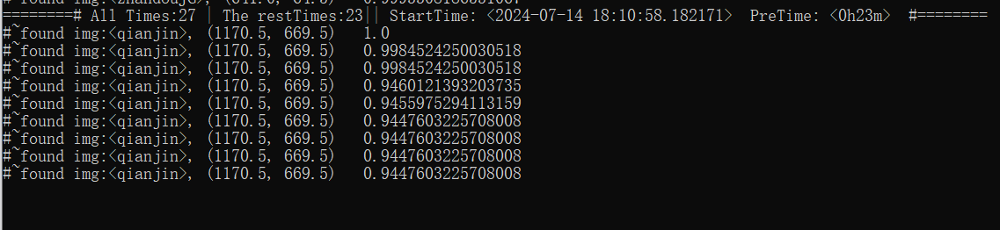

# **战舰少女R的战术脚本**

可以在2024.07.12期活动中，自动出征指定活动的第一个战斗点，并且会在大破后自动快修。

## 安装方法：

1. 安装python 3.10版本
2. (!)安装adb工具，并将adb工具添加到环境变量，之后替换模拟器的自带adb
3. 下载整个项目
4. 启动脚本中的 install.bat

## 使用方法：

1. 使用mumu12模拟器，打开舰R，进入活动图选图界面
2. 启动脚本文件夹中的 run.bat

1. 使用其他模拟器：请先找到模拟器的adb端口
2. 将端口号填入脚本文件夹中的./tool/adbTool.py 文件中：修改127.0.0.1:XXXXX 中的XXXXX为你的模拟器端口号
3. 点击run.bat启动

---

**运行截图：**

